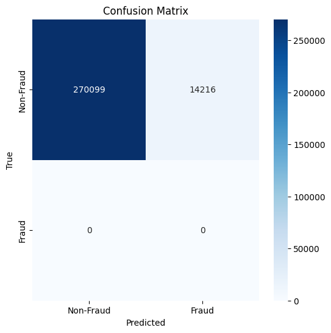
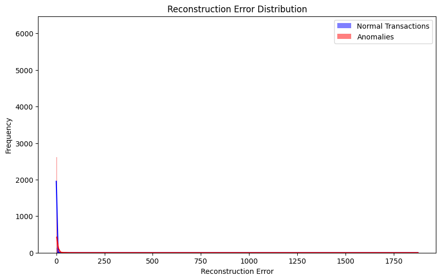

# Fraud Detection in Financial Transactions Using Autoencoders

Autoencoders are unsupervised neural networks used for anomaly detection. The idea behind using them for fraud detection is that they are trained to learn a compressed representation of the data (normal transactions). When a fraudulent transaction occurs, the reconstruction error of the autoencoder will be significantly higher, signaling that the transaction is anomalous.

## 1. Data Collection

I used [Credit Card Fraud Detection](https://www.kaggle.com/datasets/mlg-ulb/creditcardfraud?resource=download) dataset from kaggle.

The dataset typically includes:

Time: Time elapsed since the first transaction.
V1, V2, ..., V28: 28 anonymized features representing transaction characteristics.
Amount: The transaction amount.
Class: Fraudulent (1) or Non-fraudulent (0) transaction.

## Directory Structure

```
    Fraud_Detection/
    │
    ├── data/
    │   ├── raw/               # Raw data files (unmodified, original data)
    │   ├── processed/         # Preprocessed data files ready for modeling
    │
    ├── notebooks/
    │   ├── 01_data_exploration.ipynb  # Notebook for EDA (Exploratory Data Analysis)
    │   ├── 02_preprocessing.ipynb     # Notebook for data cleaning and preprocessing
    │   ├── 03_modeling.ipynb          # Notebook for model training
    │   └── 04_evaluation.ipynb        # Notebook for model evaluation and results
    │
    ├── scripts/
    │   ├── data_processing.py   # Python script for data preprocessing
    │   ├── train_model.py       # Python script for model training
    │   └── evaluate_model.py    # Python script for evaluation
    │
    ├── models/
    │   ├── saved_models/        # Serialized models (e.g., .pkl, .h5)
    │   └── model_logs/          # Logs and checkpoints from training
    │
    ├── results/
    │   ├── figures/             # Visualizations, plots
    │   ├── reports/             # Analysis reports, markdowns
    │   └── metrics/             # Saved evaluation metrics (e.g., CSV, JSON)
    │
    ├── requirements.txt         # Python dependencies
    ├── README.md                # Project overview and instructions
    └── config.yaml              # Configuration file for project-wide parameters
```

## 2. Data Preprocessing

Clean and process the data for modelling purpose and save in a csv file.

## 3. Define the model

An autoencoder has an encoder (compresses the data) and a decoder (reconstructs the data). We'll use fully connected layers for both the encoder and decoder.

```
    class Autoencoder(nn.Module):
        def __init__(self):
            super(Autoencoder, self).__init__()
            
            # Encoder part
            self.encoder = nn.Sequential(
                nn.Linear(29, 14),  # Input layer (29 features) -> hidden layer (14 features)
                nn.ReLU(),
                nn.Linear(14, 7),   # Hidden layer -> smaller hidden layer (7 features)
                nn.ReLU(),
                nn.Linear(7, 3),    # Bottleneck layer (compressed representation)
                nn.ReLU()
            )
            
            # Decoder part
            self.decoder = nn.Sequential(
                nn.Linear(3, 7),    # Bottleneck layer -> hidden layer (7 features)
                nn.ReLU(),
                nn.Linear(7, 14),   # Hidden layer -> hidden layer (14 features)
                nn.ReLU(),
                nn.Linear(14, 29),  # Hidden layer -> output layer (29 features)
                nn.Sigmoid()        # To bring the output in range [0,1] (same as input range)
            )
        
        def forward(self, x):
            x = self.encoder(x)
            x = self.decoder(x)
            return x
```

## 4. Train model

We will train the autoencoder using only normal transaction data (unsupervised). The goal is for the autoencoder to learn how to reconstruct normal transaction data well. The model is trained using Mean Squared Error (MSE) as the loss function because we want to minimize the difference between the original and reconstructed data. We use Adam optimizer for efficient training.

## 5. Anomaly Detection and Thresholding

After the model is trained, we calculate the reconstruction error for all the data points. If the reconstruction error is high, it's likely an anomaly (fraudulent transaction). The threshold is set to the 95th percentile of the reconstruction errors from normal transactions.

## 6. Evaluate model

Since we're working with a labeled dataset, we can evaluate the performance using metrics like confusion matrix, precision, recall, and F1-score.

## Classification report

We can calculate the performance metrics using the sklearn libraries.

```
    from sklearn.metrics import classification_report

    # Generate classification report as a dictionary
    report = classification_report(y_true, y_pred, output_dict=True)
```

The generated report from the model.
```
                precision    recall  f1-score        support
    0              1.000000  0.949999  0.974359  284315.000000
    1              0.000000  0.000000  0.000000       0.000000
    accuracy       0.949999  0.949999  0.949999       0.949999
    macro avg      0.500000  0.475000  0.487179  284315.000000
    weighted avg   1.000000  0.949999  0.974359  284315.000000
```

## Confusion matrix

Since, we tested the autoencoder on a dataset without including any fraud samples, the bottom row (Fraud) of the confusion matrix would naturally be empty because the model was never evaluated on Fraud cases.

<p align="center">
  
</p>

## Reconstruction Error

n an autoencoder, the model learns to compress input data into a lower-dimensional representation (latent space) and then reconstruct it back to its original form. The reconstruction error measures the difference between the original input and the reconstructed output.

- Blue indicates autoencoder effectively reconstructs normal transcation with minimal error.
- Red indicates autoencoder struggles to reconstruct anomalous transcations resulting in significantly higher errors. Since, the autoencoder is trained on non-fraudulent data it results into higher reconstruction errors.

<p align="center">
  
</p>

## Collaboration

Feel free to use this codebase for your projects. If you want to talk more about this project or have found bugs, create a pull request or contact me on **pujantamang92@gmail.com**.